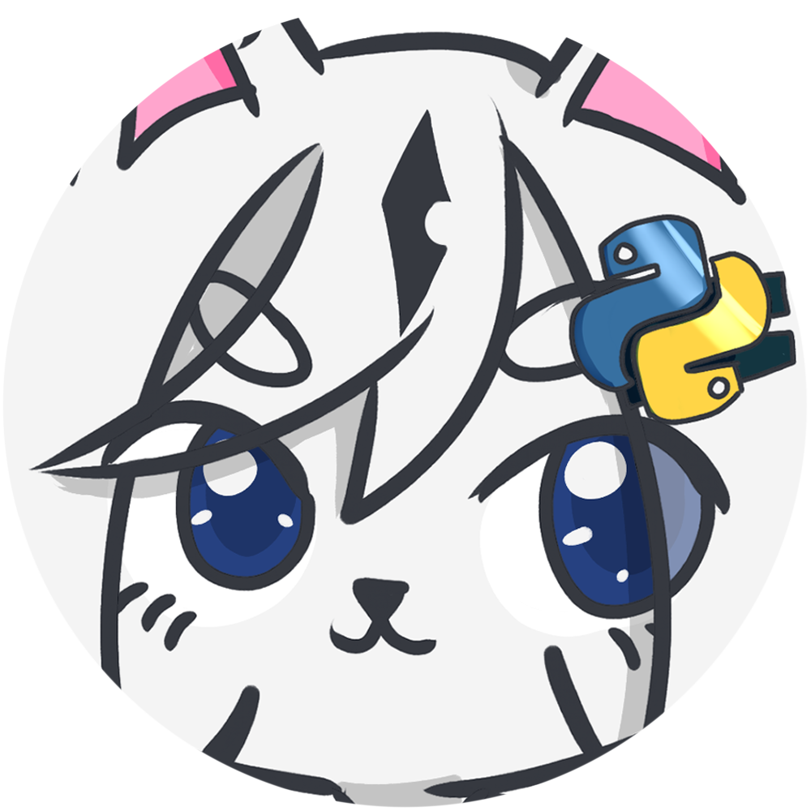

# Kohaku


Kohaku is a open-source Discord bot coded in Python with [discord.py](https://discordpy.readthedocs.io/en/latest/) by Niatsuna.
The bot is specified on certain games and is merely a hobby project.<br>
<br>
If you need help or want to share critique, please contact Niatsuna on Discord via: ✦ Niatsuna ✦#6787
<br>
**Needed:** <br>

<br>
<br>
## Table of contents
* [Quick Example](#example)
* [Features](#features)
    * [General](#features_general)
    * [Discord Games](#features_discordgames)
    * [Game information](#features_gameinformation)
* [Getting Started](#start)
    * [Requirements](#start_requirements)
    * [Organisation](#start_organistaion)
    * [Usage](#start_usage)
* [Development](#development)
* [Special Thanks](#special_thanks)
<br>

<a name="example">

## Quick Example
In this example for v2.0, Kohaku has the option to answer your 'yes/no'-question like a magic 8ball.<br>
The default prefix is `-` and the command is `8b`.
```python
@commands.command(pass_context=True, aliases=ALIASES)
    async def magic8ball(self, ctx, *, param):
        for m in ctx.message.mentions:
            for r in ['<!@{}>'.format(m.id), '<@{}>'.format(m.id)]:
                param = param.replace(r, m.display_name)
        h_param = int(hashlib.sha1(param.lower().replace(' ', '').encode('utf-8')).hexdigest(), 16)
        a_range = self.answers[h_param % 2]
        description = '🎱 {}'.format(a_range[random.randint(0, len(a_range)-1)])
        await utils.embed_send(ctx, utils.embed_create(title='"{}"'.format(param), description=description))
```


As an Example:
If you like to ask the question `Do you like it here?` the message should look like
`-8b Do you like it here?`.<br> 
Kohaku then generates an answer to your question.
<br>
<br>
<br>
<br>
<br>
<br>
<br>
<a name="features">

## Features
This is a bot that mainly focuses on little gimmicks and game information. Kohaku is **not** perfect, necessary or a good example for a bot. <br>
**Like mentioned before:** This is a hobby project. Not a product of a company.
<a name="features_general">

### General
The general features are a group of features, which are part of Kohaku's core operations.

* :scroll: Help - Shows a normal help message for Kohaku or for a specific command.
* :postal_horn: Server - Shows an information card of the specific server
* :file_folder: Profile System - Kohaku as an own profile system.
    * EXP - For every message (that is readable for Kohaku) you gain 2 to 10 EXP
    * Level - A certain amount of EXP is a milestone of a level.
    * View - You can view your own or the profile of other people with `-status`
    * Edit - You can edit your own profile and store a description (for example: Your Accountname / UID)
* :mega: Rank System - Kohaku has a own rank system with moderators, admins and co.
    * Add Gifs / Emotes - Admins can add specific keys for gifs and emotes. Kohaku can then use these emotes or react to specific key words with a gif.
    * Remove Gifs / Emotes - Admins can remove added gifs and emotes.
    * Timeout - Team members can timeout other users. These users can't interact with Kohaku for the given time. (Can also be used to ban people)
    * Update / Reload - Admins can reload commands and update resources
* 🏓 Ping - Pings Kohaku and returns the ping in ms.
* :tv: Gif - Returns a random gif from tenor. (Please use with caution!)
<a name="features_discordgames">

### Discord Games
Kohaku has little games and gimmicks you can use to waste your time.
* :8ball: Magic 8 ball - Answers your 'yes/no'-questions
* :tropical_drink: Never Have I Ever - Drink if you did it, pass if you didn't.
* :ab: Would You Rather - Would you rather A or B ?
* :scissors: Rock Paper Scissors - Play against Kohaku!
* :game_die: Roll - Roll the dice! (**Also:** Useful for DnD!)
* :heart: Love - Specifies how much love is between you and the other person
<a name="features_gameinformation">

### Game information
This bot started with the intention to provide game information for various occasions.<br>
Basically: I was to lazy to google it myself correctly.
* :desert_island: Animal Crossing : New Horizons
<a name="start">

## Getting Started
The following section is about the requirements, the overall organisation of the code and the general usage of Kohaku.
<a name="start_requirements">

### :exclamation: Requirements
To get Kohaku working you first and foremost need **at least** the following modules (beside Python v3.7). Each and everyone can be installed using<br>
```python
pip install <module>
```


<br>

All these requirements can also be found in the [requirements.txt](requirements.txt) file which is used to deploy Kohaku at the moment.<br>
This documentation should be updated on a regular basis but if something is missing check out the file instead.<br>
<br>
Furthermore you need a [Google Firebase Realtime Database](https://firebase.google.com/) to store the profile data. Another database or just a json file is good enough but you will need to change some code.

<a name="start_organisation">

### :question: Organisation
In general Kohaku is divided in 3 groups: Backend, Cogs and Resources
* Backend
    * checks - stores functions for commands checks (example: does the user have the rank `admin`)
    * constants - stores constants; like :  urls, error messages, etc.
    * Firebase - stores and object for better communication with the database.
    * utils - stores useful functions for every cog; like: store and load jsons, image editing, embed creation, etc.
* Cogs - Folder for all cogs. Each Cog represents one command or command-group and will be automatically loaded at start.
* Resources - Folder for Kohaku's resources. Kohaku will be storing (temporary) data in this folder.

[app.py](app.py) is the core of Kohaku. It loads the token, the credentials for the database and each cog automatically and then runs the bot and the given data.<br>
Specific events are handled by the [EventHandler](Bot/Cogs/EventHandler.py), which is the only Cog without a command.
You are welcome to look around and test for yourself! 
<a name="start_usage">

### :o: Usage
To start Kohaku you need a token from discord and your database credentials. On the default setting the command
```python
python3 app.py $BOT-TOKEN $CREDENTIALS
```
should start Kohaku. After that Kohaku will use the credentials to open up a connection to your firebase realtime database. Furthermore: Kohaku will store your credentials in a .json file.
Which means: After the successful first start, you don't need to parse the credentials anymore.

Kohaku will inform you on start, which cogs were successfully loaded and which not. After that your Kohaku-Instance is ready to use:

The default prefix is `-`, the default help message can be found under the command `help`. If you want to have the general help message type
```python
-help
```
If you want to have the help message of a command or a command group, type
```python
-help <command_name/command_alias>
```
<a name="development">

## Development
During development Kohaku changed quite a bit. I have many features planned and i am open for more.
Here is a list on what is planned right now:
* (Dynamic) Role manager
* Genshin Impact Information
* Alarm
* Strawpoll
* Randomizer
* Pokedex + Pokegacha

Sadly, some features didn't make it. Some of them were planned, some of them were even in Kohaku but were cut out, because of a variety of reasons. Maybe some of them will return:
* Dead by Daylight (Less Usage, API died)
* Final Fantasy XIV (Less Usage, BIG Project)
* Fate/Grand Order (Less Usage, BIG Project)
* LaTex
* Math
* Patch-Notes posting
<a name="special_thanks">

## Special Thanks
There were many things i needed help or someone had a great idea.
There are also many people that are testing Kohaku for free.
To these awesome people:


<br>
<i align="center" style="font-size: .85em">Source: Anime "Anima Yell!"</i>
<br><br>

A few special mentions:
* [Nariax3](https://twitter.com/Nariax3) (Main-Tester)
* Lirby (Main-Tester)
* [fwcd](https://github.com/fwcd) (Docker)
* [H1ghBre4k3r](https://github.com/H1ghBre4k3r) (Hosting)
* [JulianGrabitzky](https://github.com/JulianGrabitzky)
* [JoBlouu](https://www.twitch.tv/joblouu) (Check her out!)
* Awesome people form **THE** IT-Server
* Awesome people from the JoBlouu-Server
* Many more!